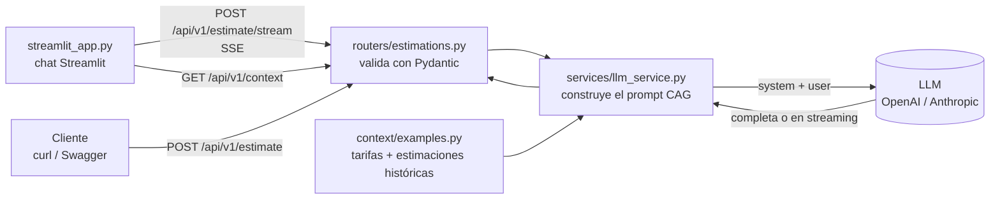
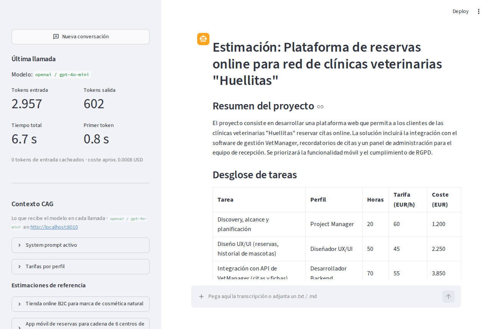

# Estimador CAG

Servicio FastAPI que recibe la **transcripción de una reunión con un cliente** y devuelve una
**estimación de proyecto de software** (desglose de tareas, horas, costes, equipo, duración y
riesgos) generada por un LLM.

Es el Proyecto 1 del programa AI Engineering 2026/09 (LIDR), en su primera fase:
**arquitectura CAG (Cache Augmented Generation)**. Todo el contexto que necesita el modelo
(tarifas y estimaciones históricas de la empresa) viaja en cada llamada. No hay base de datos,
ni retrieval, ni persistencia.

Desde la sesión 3 incluye una **interfaz de chat con Streamlit** ([`streamlit_app.py`](streamlit_app.py)):
se pega la transcripción y la estimación aparece en streaming, token a token, con el contexto CAG
y las métricas de la llamada en el panel lateral. Ver [Interfaz de chat](#interfaz-de-chat-streamlit).

## Arquitectura



| Capa | Archivo | Responsabilidad |
| --- | --- | --- |
| Entrada | `app/main.py` | Crea la app, registra el router con prefijo `/api/v1`, `/health`, traduce errores del LLM a HTTP |
| Configuración | `app/config.py` | `BaseSettings` que lee `.env` y valida al arrancar (si falta la API key del proveedor, no arranca) |
| Transporte | `app/routers/estimations.py` | Endpoint fino: recibe, delega y devuelve |
| Negocio | `app/services/llm_service.py` | Preprocesa el contexto, arma los mensajes, llama al proveedor y normaliza la respuesta |
| Contratos | `app/schemas/estimation.py` | Request/response con Pydantic (documentados en Swagger) |
| Contexto CAG | `app/context/examples.py` | Tarifas por perfil y 3 estimaciones históricas ficticias |
| Interfaz | `streamlit_app.py` | Chat Streamlit: cliente HTTP de la API, sin lógica de IA |

| Endpoint | Qué hace |
| --- | --- |
| `POST /api/v1/estimate` | Estimación completa en JSON (`EstimationResponse`) |
| `POST /api/v1/estimate/stream` | La misma estimación en streaming con Server-Sent Events |
| `GET /api/v1/context` | System prompt, tarifas y estimaciones de referencia (lo que ve el modelo) |
| `GET /health` | Estado, entorno, proveedor y modelo activos |

Estructura de mensajes enviada al modelo:

```
[system]    → rol + uso del contexto + formato de salida + tarifas + estimaciones de referencia + reglas
[user]      → <transcripcion>…</transcripcion>
[assistant] → estimación en Markdown
```

## Decisiones de diseño

- **CAG en lugar de RAG.** Tres estimaciones de referencia ocupan unos 1.800 tokens: caben de
  sobra en la ventana de contexto de `gpt-4o-mini` (128K) o `claude-haiku-4-5` (200K). Cuando
  el histórico crezca a cientos de presupuestos, `context/` se sustituirá por un servicio de
  búsqueda semántica sin tocar routers ni schemas.
- **Contexto estructurado y preprocesado.** Los ejemplos se guardan como datos (tareas, perfil,
  horas) y el servicio **calcula costes y totales** antes de inyectarlos. Así el modelo no tiene
  que hacer aritmética para entender las referencias, y las tarifas tienen una única fuente de verdad.
- **Ejemplos variados.** E-commerce web, app móvil e integración/herramienta interna, para
  calibrar sin sesgar el modelo hacia una sola tipología.
- **Orden del prompt por "lost in the middle".** Instrucciones y formato al principio, referencias
  (delimitadas con `===== ESTIMACIÓN DE REFERENCIA N =====`) en el medio, reglas al final y la
  transcripción como último mensaje.
- **Formato de los ejemplos igual al de la salida esperada** (Markdown con tabla), porque el
  modelo imita lo que ve en su contexto.
- **Prefijo estático.** El system prompt se construye una sola vez y es idéntico en cada llamada,
  lo que permite que el proveedor lo cachee (prompt caching) cuando supere el tamaño mínimo.
- **Dos proveedores tras una misma función.** `LLM_PROVIDER` elige OpenAI (Responses API) o
  Anthropic (Messages API). Las diferencias (system como mensaje o como parámetro, nombre de los
  campos de uso, `finish_reason`) se normalizan en `LLMResult`.
- **Clientes asíncronos** (`AsyncOpenAI` / `AsyncAnthropic`): una llamada al LLM tarda segundos y
  no debe bloquear el event loop de FastAPI.
- **Streaming con el mismo contrato.** `stream_estimation` comparte con `generate_estimation` el
  prompt, la traducción de errores y las métricas; solo cambia cómo se consume el SDK
  (Responses API con `stream=True` / `messages.stream()` de Anthropic).

## Latencia, coste, calidad y seguridad

- **Latencia:** cada respuesta incluye `latency_ms`. Hay timeout configurable
  (`LLM_TIMEOUT_SECONDS`) y 2 reintentos automáticos del SDK.
- **Coste:** se usan modelos económicos por defecto y la respuesta incluye `usage` (tokens de
  entrada, salida y cacheados) y `estimated_cost_usd`. `max_length` en la transcripción y
  `LLM_MAX_OUTPUT_TOKENS` acotan el presupuesto de tokens.
- **Calidad:** `scripts/live_check.py` evalúa una estimación real con comprobaciones
  deterministas (secciones, tarifas del contexto, horas múltiplo de 5, coste = horas × tarifa,
  cita de la referencia usada, no truncada) y devuelve un score.
- **Truncado:** si el modelo corta por límite de tokens, la respuesta lo indica con
  `truncated: true` y se registra un warning.
- **Seguridad:** las API keys solo se leen de `.env` (ignorado por git) y se manejan como
  `SecretStr`. La transcripción va delimitada y el prompt indica tratarla como datos, no como
  instrucciones. Con OpenAI se usa `store=False` para no almacenar transcripciones de clientes.
  Los logs registran métricas, no el contenido de la transcripción.
- **Errores del proveedor:** timeout → `504`, rate limit → `503`, otros errores → `502`, sin
  exponer detalles internos.

## Interfaz de chat (Streamlit)

```bash
make dev   # API (puerto 8000) + interfaz (http://localhost:8501) a la vez; Ctrl+C para las dos
```

O por separado, en dos terminales: `make run` y `make ui` (equivale a `streamlit run streamlit_app.py`).



| Nivel del ejercicio | Cómo está resuelto |
| --- | --- |
| 1. Chat básico | `st.chat_message` + `st.chat_input` (se puede pegar texto o adjuntar un `.txt`/`.md`). El historial vive en `st.session_state`; el system prompt es el del endpoint CAG porque lo construye el backend. Botón para probar con la transcripción de ejemplo y otro para empezar una conversación nueva. |
| 2. Streaming | `st.write_stream` consume los eventos SSE de `POST /api/v1/estimate/stream`: la estimación se ve escribiéndose en Markdown, token a token. |
| 3. Contexto CAG | `st.sidebar` con el system prompt activo (bloque de solo lectura), las tarifas y las estimaciones de referencia tal como se inyectan, y las métricas de la última llamada: modelo, tokens de entrada/salida (y cacheados), tiempo total, tiempo hasta el primer token y coste aproximado. |

Decisiones de diseño:

- **Streamlit es un cliente HTTP, no un segundo backend.** No importa `llm_service` ni los SDK
  de los proveedores, y no necesita API keys (solo `ESTIMADOR_API_URL`, por defecto
  `http://localhost:8000`). La lógica de IA vive en un único sitio y el frontend se puede
  cambiar por otro (React, una app móvil…) sin tocar el servicio.
- **Server-Sent Events** en lugar de texto plano: cada evento lleva un tipo y un JSON, así que
  por el mismo stream viajan el texto y los metadatos finales.

  ```
  event: delta
  data: {"text": "## Estimación"}

  event: done
  data: {"model": "gpt-4o-mini", "usage": {...}, "latency_ms": 6309, "truncated": false, ...}
  ```

  Si el proveedor falla a mitad de la respuesta, llega `event: error` con
  `{"detail", "status_code"}`.
- **Errores tempranos con su código HTTP.** El endpoint espera al primer fragmento del modelo
  antes de responder. Si el proveedor falla de entrada (API key, rate limit, timeout), el
  cliente recibe 502/503/504 igual que con `POST /estimate`, y no un `200` con un error dentro.
  Por eso no se usa `EventSourceResponse` como `response_class` (obliga a que el endpoint sea un
  generador) sino un `StreamingResponse` con `text/event-stream`.
- **Cierre del stream.** Si el usuario abandona la respuesta (recarga la página, pulsa *Nueva
  conversación*), los generadores se cierran en cadena (`aclosing`) y se corta también la
  conexión con el proveedor: no se siguen pagando tokens que nadie va a leer.
- **Cada mensaje se estima por separado** (single-turn, igual que el endpoint): el historial se
  ve en pantalla, pero no se reenvía al modelo. Una estimación a medias (stream cortado) se queda
  en pantalla, pero no entra en el historial.

## Puesta en marcha

Requisitos: [uv](https://docs.astral.sh/uv/getting-started/installation/) y una API key de OpenAI
o Anthropic. `uv` instala Python 3.13 automáticamente si no lo tienes.

```bash
cd estimador-cag
make run   # la primera vez crea .env: completa OPENAI_API_KEY (o ANTHROPIC_API_KEY + LLM_PROVIDER=anthropic)
```

`make run` instala las dependencias (`uv sync`) y arranca `uvicorn app.main:app --reload`.
Otro puerto: `make run PORT=9000`.

- Swagger UI: http://localhost:8000/docs (también redirige desde `/`)
- Health: `curl http://localhost:8000/health`

| Comando | Qué hace |
| --- | --- |
| `make run` | Arranca el servidor con recarga automática (target por defecto) |
| `make ui` | Interfaz de chat Streamlit (con la API en marcha) |
| `make dev` | API + interfaz a la vez |
| `make test` | Tests con el LLM simulado (sin coste) |
| `make lint` | Lint y formato con ruff |
| `make format` | Formatea el código y aplica arreglos automáticos |
| `make live` | Estimación real + evaluación determinista (con el servidor en marcha) |
| `make help` | Lista los comandos |

Sin `make`, los equivalentes son `uv run uvicorn app.main:app --reload`, `uv run pytest`, etc.

Ejemplo de petición:

```bash
curl -X POST http://localhost:8000/api/v1/estimate \
  -H "Content-Type: application/json" \
  -d '{"transcription": "En la reunión con el equipo de marketing, el cliente explicó que necesita una landing page con formulario de contacto, integración con su CRM actual (HubSpot), y una sección de blog con editor WYSIWYG. El plazo ideal sería tenerlo listo en 4 semanas. El diseño ya existe en Figma."}'
```

Respuesta (resumida):

```json
{
  "model": "gpt-4o-mini",
  "provider": "openai",
  "usage": {"input_tokens": 2350, "output_tokens": 780, "cached_input_tokens": 0},
  "estimated_cost_usd": 0.00082,
  "latency_ms": 9120,
  "finish_reason": "completed",
  "truncated": false,
  "created_at": "2026-10-06T10:00:00Z",
  "estimation": "## Estimación: ...\n\n### Resumen del proyecto\n..."
}
```

En streaming (`-N` para que curl no acumule la salida):

```bash
curl -N -X POST http://localhost:8000/api/v1/estimate/stream \
  -H "Content-Type: application/json" \
  -d '{"transcription": "En la reunión con el equipo de marketing, el cliente explicó que necesita una landing page con formulario de contacto e integración con HubSpot."}'
```

### Transcripción de prueba

[`transcripciones/reunion_red_veterinaria.md`](transcripciones/reunion_red_veterinaria.md) es una
reunión ficticia (red de clínicas veterinarias: reservas online, integración con su software de
gestión y recordatorios por WhatsApp). Incluye charla irrelevante a propósito, para comprobar
que el modelo la ignora. Para estimarla y evaluar el resultado con el servidor en marcha:

```bash
make live
```

## Tests y validación automática

```bash
make test   # estructura, prompt CAG y endpoints con el LLM simulado (sin coste)
make lint   # lint y formato
```

- `tests/test_structure.py`: la estructura de carpetas es la del ejercicio, `.env` está en
  `.gitignore`, `.env.example` documenta las variables sin valores y no hay keys en el código.
- `tests/test_prompt.py`: los ejemplos se inyectan con delimitadores, los costes se precalculan
  bien y el orden del prompt es instrucciones → referencias → reglas.
- `tests/test_api.py`: `/health`, `/docs`, `POST /api/v1/estimate` (con el proveedor simulado),
  validación de entrada (422) y traducción de errores del proveedor (503).
- `tests/test_streaming.py`: eventos SSE `delta` → `done`, error antes del primer token como
  HTTP 503, error a mitad del stream como evento `error`, respuesta vacía, `/context`, y cómo se
  normalizan los eventos de streaming de OpenAI (completo, truncado, fallido) y de Anthropic.
- `tests/test_streamlit_app.py`: el cliente SSE contra la API real (con el LLM simulado) y la app
  completa con `streamlit.testing` (`AppTest`): contexto en el sidebar, dos estimaciones seguidas
  que quedan en el historial, métricas, botón de ejemplo y API caída.

El pipeline [`.github/workflows/estimador-cag-ci.yml`](../.github/workflows/estimador-cag-ci.yml)
se ejecuta en cada push: comprueba que no haya `.env` versionado, instala con `uv sync --locked`,
pasa ruff y pytest y arranca la API y la interfaz Streamlit para probar `/health`, `/docs`, el
OpenAPI, `/api/v1/context` y el health check de Streamlit. Lanzado a mano (`workflow_dispatch`) y con el secreto `OPENAI_API_KEY` configurado, también ejecuta la
prueba end-to-end con el LLM real.

## Variables de entorno

| Variable | Descripción | Por defecto |
| --- | --- | --- |
| `OPENAI_API_KEY` | API key de OpenAI | Requerida si se usa OpenAI |
| `ANTHROPIC_API_KEY` | API key de Anthropic | Requerida si se usa Anthropic |
| `LLM_PROVIDER` | `openai` o `anthropic` | `openai` |
| `LLM_MODEL` | Modelo a utilizar | `gpt-4o-mini` / `claude-haiku-4-5` |
| `LLM_MAX_OUTPUT_TOKENS` | Límite de tokens de salida | `3000` |
| `LLM_TEMPERATURE` | Temperatura (solo OpenAI) | `0.2` |
| `LLM_TIMEOUT_SECONDS` | Timeout de la llamada al LLM | `60` |
| `APP_ENV` | Entorno de ejecución | `development` |
| `LOG_LEVEL` | Nivel de logging | `DEBUG` |
| `ESTIMADOR_API_URL` | URL de la API que usa la interfaz Streamlit (no va en `.env`: es del cliente) | `http://localhost:8000` |

## Limitaciones

- Single-turn: no se puede refinar una estimación en varios turnos. La interfaz muestra el
  historial, pero cada mensaje se estima por separado.
- `GET /api/v1/context` expone el system prompt. Aquí no es secreto (el repo es público), pero en
  producción habría que protegerlo o desactivarlo.
- La interfaz es para demos y pruebas internas: sin autenticación ni persistencia de
  conversaciones (se pierden al recargar la página).
- Los ejemplos de referencia son ficticios y estáticos. La calidad depende de lo representativos
  que sean.
- La aritmética la hace el modelo: los totales de la estimación generada pueden tener errores
  (el `live_check` los detecta, pero el servicio todavía no los corrige).
- La salida es Markdown libre, no datos estructurados validados.
- Sin autenticación, rate limiting propio ni guardrails de entrada/salida.
- La tabla de precios para `estimated_cost_usd` es aproximada y hay que actualizarla a mano.
