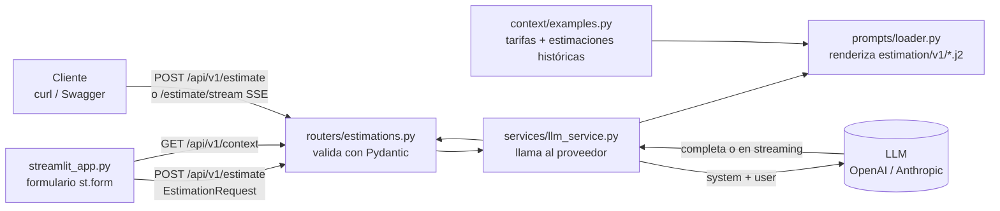

# Estimador CAG

Servicio FastAPI que recibe la **descripción de un proyecto de software** (o la transcripción de
una reunión con el cliente) y tres parámetros: **tipo de proyecto, nivel de detalle y formato**.
Devuelve una **estimación** (desglose, horas, costes, equipo, duración y riesgos) generada por un
LLM.

Es el Proyecto 1 del programa AI Engineering 2026/09 (LIDR), en su primera fase:
**arquitectura CAG (Cache Augmented Generation)**. Todo el contexto que necesita el modelo
(tarifas y estimaciones históricas de la empresa) viaja en cada llamada. No hay base de datos,
ni retrieval, ni persistencia.

| Sesión | Qué añade |
| --- | --- |
| 2 | API FastAPI con arquitectura CAG y dos proveedores (OpenAI / Anthropic) |
| 3 | Interfaz de chat con Streamlit y estimación en streaming (SSE) |
| 4 | Formulario con parámetros tipados en lugar del chat y prompt en plantillas Jinja2 versionadas |

## Sesión 4: del chat a la interfaz de producto

Qué cambia:

- **Contrato tipado** ([`app/schemas/estimation.py`](app/schemas/estimation.py)):
  `EstimationRequest(description, project_type, detail_level, output_format)` con tres enums
  (`ProjectType`, `DetailLevel`, `OutputFormat`). La respuesta, `EstimationResponse`, lleva `text`
  y `prompt_version`, además de las métricas de la llamada.
- **Formulario** ([`streamlit_app.py`](streamlit_app.py)): `st.form` + `st.form_submit_button`.
  Produce un `EstimationRequest` y hace `POST /api/v1/estimate`.
- **Prompts en Jinja2** ([`app/prompts/`](app/prompts/)): `estimation/v1/{system,user,examples}.j2`
  y un loader con `render_estimation_prompt(request, version="v1") -> (system, user)`
  (`StrictUndefined`, `trim_blocks`, `lstrip_blocks`). Ver
  [Prompts versionados](#prompts-versionados-jinja2).
- **Endpoint refactorizado:** usa el loader, envía `system` y `user` como mensajes separados y
  devuelve `prompt_version: "v1"`. El wrapper de proveedores de las sesiones anteriores no cambia.
- **Tests de plantilla** ([`tests/prompts/test_estimation_v1.py`](tests/prompts/test_estimation_v1.py)):
  los tres que pide el ejercicio y más, todos sin llamar a ningún LLM.

En qué se aparta del enunciado, y por qué:

- **`description` acepta hasta 80.000 caracteres** (el enunciado dice 2.000). Es el límite de la
  solución de referencia del curso, que acepta también la transcripción completa de una reunión.
  La transcripción de ejemplo tiene 3.841 caracteres.
- **La respuesta conserva las métricas** (modelo, tokens, coste, latencia, truncado) junto a
  `text` y `prompt_version`: el panel lateral las sigue mostrando.
- **La interfaz ya no usa streaming.** Como en la clase en vivo 4, el formulario llama a
  `POST /api/v1/estimate` y espera la respuesta completa. `POST /api/v1/estimate/stream` sigue en
  la API, con el mismo loader.
- **El prompt está en español.** Los few-shot de `examples.j2` son las 3 estimaciones históricas
  de [`app/context/examples.py`](app/context/examples.py), con los costes y totales calculados en
  Python.
- **Queda pendiente lo de la clase en vivo 3:** LiteLLM con fallback entre proveedores, caché
  exact-match en Redis y structlog. Este proyecto sigue con su wrapper propio de dos proveedores
  y con `logging` estándar.

Cómo levantar y testear:

```bash
cd estimador-cag
make dev                    # API (:8000) + formulario en http://localhost:8501
make test                   # toda la suite, con el LLM simulado (sin coste)
uv run pytest tests/prompts # solo los tests de plantilla (milisegundos)
```

## Arquitectura



| Capa | Archivo | Responsabilidad |
| --- | --- | --- |
| Entrada | `app/main.py` | Crea la app, registra el router con prefijo `/api/v1`, `/health`, traduce errores del LLM a HTTP |
| Configuración | `app/config.py` | `BaseSettings` que lee `.env` y valida al arrancar (si falta la API key del proveedor, no arranca) |
| Transporte | `app/routers/estimations.py` | Endpoint fino: recibe, delega y devuelve |
| Negocio | `app/services/llm_service.py` | Arma los mensajes con el loader, llama al proveedor y normaliza la respuesta |
| Prompts | `app/prompts/loader.py` + `app/prompts/estimation/v1/*.j2` | Plantillas Jinja2 versionadas; el loader es el único punto donde Python las toca |
| Contratos | `app/schemas/estimation.py` | Request/response con Pydantic (documentados en Swagger) |
| Contexto CAG | `app/context/examples.py` | Tarifas por perfil y 3 estimaciones históricas ficticias, con costes y totales precalculados |
| Interfaz | `streamlit_app.py` | Formulario Streamlit: cliente HTTP de la API, sin lógica de IA |

| Endpoint | Qué hace |
| --- | --- |
| `POST /api/v1/estimate` | Estimación completa en JSON (`EstimationResponse`). Es la que usa el formulario |
| `POST /api/v1/estimate/stream` | La misma estimación en streaming con Server-Sent Events |
| `GET /api/v1/context` | System prompt para unos parámetros (`?project_type=…&detail_level=…&output_format=…`), tarifas y referencias |
| `GET /health` | Estado, entorno, proveedor y modelo activos |

Estructura de mensajes enviada al modelo:

```
[system]    → system.j2: rol + uso del contexto + tarifas + examples.j2 + reglas
              + tipo de proyecto + formato de salida + nivel de detalle (según el formulario)
[user]      → user.j2: <project_description>…</project_description>
[assistant] → estimación en Markdown
```

## Prompts versionados (Jinja2)

```
app/prompts/
├── loader.py            # render_estimation_prompt(request, version="v1") -> (system, user)
└── estimation/
    └── v1/
        ├── system.j2    # rol, tarifas, reglas y un bloque condicional por parámetro
        ├── user.j2      # <project_description>…</project_description>
        └── examples.j2  # few-shot: las 3 estimaciones históricas ( desde system.j2)
```

- **Cada parámetro activa su bloque** con ``:
  - `output_format` define las secciones de la respuesta:
    - `phases_table`: tabla `Fase | Perfiles (horas) | Horas | Coste (EUR) | Semanas | Confianza (%)`;
    - `line_items`: tabla `Tarea | Perfil | Horas | Tarifa | Coste`;
    - `narrative`: prosa sin tablas ni listas.
  - `detail_level` define la granularidad. `detailed` añade los supuestos por fase y la
    mitigación de cada riesgo.
  - `project_type` nombra el tipo de proyecto y lo que se suele olvidar en él (las stores en una
    app móvil, la monitorización en un pipeline de datos…).
- **Entorno Jinja2 estricto.** Con `StrictUndefined`, una variable que falta rompe el render en
  vez de producir un prompt mal formado en silencio. `trim_blocks` y `lstrip_blocks` quitan los
  saltos y la indentación que dejan los ``. `autoescape=False`, porque el destino es un LLM,
  no HTML.
- **Prefijo estático.** Lo que no cambia entre peticiones (rol, tarifas, ejemplos y reglas) va
  primero y es idéntico en las 36 combinaciones de parámetros, así que el proveedor lo puede
  cachear (prompt caching). Los bloques que dependen del formulario van al final, junto al mensaje
  del usuario. Hay un test que lo comprueba.
- **Delimitadores XML** (`<examples>`, `<rules>`, `<output_format>`, `<project_description>`…),
  como en el curso, con el contenido en Markdown.
- **Los datos se preparan en Python y la plantilla solo los presenta.** `reference_estimations()`
  calcula el coste de cada tarea y los totales; `examples.j2` los recorre con ``.
- **Versionado.** Una versión nueva del prompt es una carpeta `v2/` al lado de `v1/`, sin tocar la
  anterior. `PROMPT_VERSION` en `loader.py` elige la activa, y cada respuesta indica con qué
  versión se generó (`prompt_version`). El loader registra en DEBUG la versión y un hash del
  system prompt renderizado, sin su contenido.
- **Para ver un prompt renderizado**, usa `GET /api/v1/context` con los parámetros o el panel
  lateral de la interfaz.

## Decisiones de diseño

- **CAG en lugar de RAG.** Tres estimaciones de referencia ocupan unos 1.800 tokens: caben de
  sobra en la ventana de contexto de `gpt-4o-mini` (128K) o `claude-haiku-4-5` (200K). Cuando
  el histórico crezca a cientos de presupuestos, `context/` se sustituirá por un servicio de
  búsqueda semántica sin tocar routers ni schemas.
- **Formulario en lugar de chat.** El espacio de tareas es acotado: tipo de proyecto, nivel de
  detalle y formato son decisiones cerradas que el usuario elige, no prompts que tenga que
  escribir. El prompting pasa al backend, donde se versiona y se testea.
- **Contexto estructurado y preprocesado.** Los ejemplos se guardan como datos (tareas, perfil,
  horas) y el servicio **calcula costes y totales** antes de inyectarlos. Así el modelo no tiene
  que hacer aritmética para entender las referencias, y las tarifas tienen una única fuente de verdad.
- **Ejemplos variados.** E-commerce web, app móvil e integración/herramienta interna, para
  calibrar sin sesgar el modelo hacia una sola tipología.
- **Ejemplos como datos de calibración.** Con tres formatos de salida, los ejemplos (en formato
  de desglose de tareas) ya no pueden ser también el molde de la respuesta. El prompt indica que
  el formato es el que pide `<output_format>`.
- **Dos proveedores tras una misma función.** `LLM_PROVIDER` elige OpenAI (Responses API) o
  Anthropic (Messages API). Las diferencias (system como mensaje o como parámetro, nombre de los
  campos de uso, `finish_reason`) se normalizan en `LLMResult`.
- **Clientes asíncronos** (`AsyncOpenAI` / `AsyncAnthropic`): una llamada al LLM tarda segundos y
  no debe bloquear el event loop de FastAPI.
- **Streaming con el mismo contrato.** `stream_estimation` comparte con `generate_estimation` el
  prompt, la traducción de errores y las métricas; solo cambia cómo se consume el SDK
  (Responses API con `stream=True` / `messages.stream()` de Anthropic).

## Latencia, coste, calidad y seguridad

- **Latencia:** cada respuesta incluye `latency_ms`. Hay timeout configurable
  (`LLM_TIMEOUT_SECONDS`) y 2 reintentos automáticos del SDK.
- **Coste:** se usan modelos económicos por defecto y la respuesta incluye `usage` (tokens de
  entrada, salida y cacheados) y `estimated_cost_usd`. `max_length` en la descripción y
  `LLM_MAX_OUTPUT_TOKENS` acotan el presupuesto de tokens.
- **Calidad:** `scripts/live_check.py` evalúa una estimación real con comprobaciones
  deterministas (secciones, tarifas del contexto, horas múltiplo de 5, coste = horas × tarifa,
  totales, cita de la referencia usada, no truncada) y devuelve un score.
- **Truncado:** si el modelo corta por límite de tokens, la respuesta lo indica con
  `truncated: true` y se registra un warning.
- **Seguridad:** las API keys solo se leen de `.env` (ignorado por git) y se manejan como
  `SecretStr`. La descripción va delimitada en `<project_description>` y el prompt indica
  tratarla como datos, no como instrucciones. Jinja2 la inserta como texto: un `{{ … }}` escrito
  en la descripción no se evalúa (hay un test). Con OpenAI se usa `store=False` para no almacenar
  lo que cuentan los clientes. Los logs registran métricas y la versión del prompt, no el
  contenido.
- **Errores del proveedor:** timeout → `504`, rate limit → `503`, otros errores → `502`, sin
  exponer detalles internos.

## Interfaz (Streamlit)

```bash
make dev   # API (puerto 8000) + interfaz (http://localhost:8501) a la vez; Ctrl+C para las dos
```

O por separado, en dos terminales: `make run` y `make ui` (equivale a `streamlit run streamlit_app.py`).


| Campo | Widget | Valor que viaja a la API |
| --- | --- | --- |
| Descripción del proyecto | `st.text_area`, más `st.file_uploader` para adjuntar una transcripción `.txt`/`.md` | `description` |
| Tipo de proyecto | `st.selectbox` | `mobile_app`, `web_saas`, `internal_tool` o `data_pipeline` |
| Formato de salida | `st.selectbox` | `phases_table`, `line_items` o `narrative` |
| Nivel de detalle | `st.pills` | `summary`, `medium` o `detailed` |

Hay también un botón para rellenar el formulario con la transcripción de ejemplo.

Decisiones de diseño:

- **Streamlit es un cliente HTTP, no un segundo backend.** No importa `llm_service` ni los SDK
  de los proveedores, y no necesita API keys (solo `ESTIMADOR_API_URL`, por defecto
  `http://localhost:8000`). La lógica de IA vive en un único sitio y el frontend se puede
  cambiar por otro (React, una app móvil…) sin tocar el servicio.
- **Comparte el contrato, no la lógica.** De la API solo importa `app/schemas`, como sugiere el
  curso. Así el formulario produce exactamente el `EstimationRequest` que espera la API, y valida
  antes de enviar, sin gastar una petición. Los errores de validación, locales o del `422` de la
  API, se muestran en español.
- **`st.form`:** cambiar un widget no relanza el script; solo se envía al pulsar *Generar
  estimación*. El formulario conserva sus valores, así que se puede cambiar un parámetro y volver
  a generar. La última estimación se guarda en `st.session_state`.
- **Sin streaming:** `POST /api/v1/estimate` con un `st.spinner` mientras el modelo responde
  (unos 5-15 s con `gpt-4o-mini`).
- **Panel lateral:**
  - la última llamada: modelo, tokens, tiempo, versión del prompt y coste;
  - el contexto CAG: el system prompt que recibió el modelo con los parámetros enviados (lo pide
    a `GET /api/v1/context`), las tarifas y las estimaciones de referencia.

### Streaming (`POST /api/v1/estimate/stream`)

Desde la sesión 4, la interfaz no lo usa, pero sigue disponible en la API con el mismo contrato
de entrada.

- **Server-Sent Events** en lugar de texto plano: cada evento lleva un tipo y un JSON, así que
  por el mismo stream viajan el texto y los metadatos finales.

  ```
  event: delta
  data: {"text": "## Estimación"}

  event: done
  data: {"prompt_version": "v1", "model": "gpt-4o-mini", "usage": {...}, "latency_ms": 6309, ...}
  ```

  Si el proveedor falla a mitad de la respuesta, llega `event: error` con
  `{"detail", "status_code"}`.
- **Errores tempranos con su código HTTP.** El endpoint espera al primer fragmento del modelo
  antes de responder. Si el proveedor falla de entrada (API key, rate limit, timeout), el
  cliente recibe 502/503/504 igual que con `POST /estimate`, y no un `200` con un error dentro.
  Por eso no se usa `EventSourceResponse` como `response_class` (obliga a que el endpoint sea un
  generador) sino un `StreamingResponse` con `text/event-stream`.
- **Cierre del stream.** Si el cliente abandona la respuesta, los generadores se cierran en
  cadena (`aclosing`) y se corta también la conexión con el proveedor: no se siguen pagando
  tokens que nadie va a leer.

## Puesta en marcha

Requisitos: [uv](https://docs.astral.sh/uv/getting-started/installation/) y una API key de OpenAI
o Anthropic. `uv` instala Python 3.13 automáticamente si no lo tienes.

```bash
cd estimador-cag
make run   # la primera vez crea .env: completa OPENAI_API_KEY (o ANTHROPIC_API_KEY + LLM_PROVIDER=anthropic)
```

`make run` instala las dependencias (`uv sync`) y arranca `uvicorn app.main:app --reload`.
Otro puerto: `make run PORT=9000`.

- Swagger UI: http://localhost:8000/docs (también redirige desde `/`)
- Health: `curl http://localhost:8000/health`

| Comando | Qué hace |
| --- | --- |
| `make run` | Arranca el servidor con recarga automática (target por defecto) |
| `make ui` | Interfaz Streamlit (con la API en marcha) |
| `make dev` | API + interfaz a la vez |
| `make test` | Tests con el LLM simulado (sin coste) |
| `make lint` | Lint y formato con ruff |
| `make format` | Formatea el código y aplica arreglos automáticos |
| `make live` | Estimación real + evaluación determinista (con el servidor en marcha) |
| `make help` | Lista los comandos |

Sin `make`, los equivalentes son `uv run uvicorn app.main:app --reload`, `uv run pytest`, etc.

Ejemplo de petición:

```bash
curl -X POST http://localhost:8000/api/v1/estimate \
  -H "Content-Type: application/json" \
  -d '{
    "description": "El cliente necesita una landing page con formulario de contacto, integración con su CRM actual (HubSpot) y una sección de blog con editor WYSIWYG. El diseño ya existe en Figma.",
    "project_type": "web_saas",
    "detail_level": "medium",
    "output_format": "phases_table"
  }'
```

Respuesta (resumida):

```json
{
  "prompt_version": "v1",
  "model": "gpt-4o-mini",
  "provider": "openai",
  "usage": {"input_tokens": 2350, "output_tokens": 609, "cached_input_tokens": 0},
  "estimated_cost_usd": 0.000718,
  "latency_ms": 6400,
  "finish_reason": "completed",
  "truncated": false,
  "created_at": "2026-10-06T10:00:00Z",
  "text": "## Estimación: ...\n### Resumen del proyecto\n..."
}
```

Los valores de los parámetros son los del enum (`"mobile_app"`, no `"MOBILE_APP"`). Un valor
desconocido, un parámetro que falta o una descripción de menos de 20 caracteres devuelven `422`
sin llamar al LLM.

El system prompt que recibe el modelo con unos parámetros dados:

```bash
curl "http://localhost:8000/api/v1/context?project_type=mobile_app&detail_level=detailed&output_format=narrative"
```

En streaming (`-N` para que curl no acumule la salida):

```bash
curl -N -X POST http://localhost:8000/api/v1/estimate/stream \
  -H "Content-Type: application/json" \
  -d '{"description": "Landing page con formulario de contacto e integración con HubSpot.", "project_type": "web_saas", "detail_level": "summary", "output_format": "narrative"}'
```

### Transcripción de prueba

[`transcripciones/reunion_red_veterinaria.md`](transcripciones/reunion_red_veterinaria.md) es una
reunión ficticia (red de clínicas veterinarias: reservas online, integración con su software de
gestión y recordatorios por WhatsApp). Incluye charla irrelevante a propósito, para comprobar
que el modelo la ignora. Para estimarla y evaluar el resultado con el servidor en marcha (se
envía como descripción, con `line_items` y nivel `medium`):

```bash
make live
```

## Tests y validación automática

```bash
make test                   # toda la suite con el LLM simulado (sin coste)
uv run pytest tests/prompts # solo los tests de plantilla
make lint                   # lint y formato
```

- `tests/prompts/test_estimation_v1.py`: tests de la plantilla, sin LLM.
  - Los tres que pide el ejercicio:
    - la descripción va dentro de `<project_description>`;
    - `Confianza (%)` aparece con `phases_table` y no con `narrative`;
    - los «supuestos por fase» aparecen con `detailed` y no con `summary`.
  - Además:
    - cada formato y cada nivel renderizan solo su bloque;
    - se incluyen los ejemplos con sus totales y las tarifas;
    - las 36 combinaciones salen sin restos de Jinja ni líneas en blanco de más;
    - el prefijo estático es común a todas;
    - un `{{ … }}` en la descripción no se evalúa;
    - una versión que no existe da error.
- `tests/test_context.py`: costes y totales de las referencias precalculados, mensajes `system` +
  `user` renderizados desde las plantillas, la descripción sin espacios sobrantes.
- `tests/test_structure.py`: la estructura de carpetas es la de los ejercicios (incluidas las
  plantillas `v1/` y el loader), `.env` está en `.gitignore`, `.env.example` documenta las
  variables sin valores y no hay keys en el código.
- `tests/test_api.py`:
  - `/health`, `/docs` y `POST /api/v1/estimate` con el proveedor simulado (`text`,
    `prompt_version`, mensajes separados);
  - el prompt cambia según los parámetros;
  - `422` para una descripción corta, larga o de solo espacios, para enums inválidos y para
    parámetros que faltan;
  - traducción de errores del proveedor (503).
- `tests/test_streaming.py`:
  - eventos SSE `delta` → `done` (con `prompt_version`);
  - error antes del primer token como HTTP 503 y error a mitad del stream como evento `error`;
  - respuesta vacía;
  - `/context` con y sin parámetros;
  - cómo se normalizan los eventos de streaming de OpenAI (completo, truncado, fallido) y de
    Anthropic.
- `tests/test_streamlit_app.py`:
  - el cliente HTTP contra la API real, con el LLM simulado;
  - la app completa con `streamlit.testing` (`AppTest`): el formulario con sus valores por
    defecto, el envío con otros parámetros (que llegan al prompt y al panel lateral), la
    validación local sin llamar a la API, la API caída y la transcripción de ejemplo.

El pipeline [`.github/workflows/estimador-cag-ci.yml`](../.github/workflows/estimador-cag-ci.yml)
se ejecuta en cada push:

- comprueba que no haya `.env` versionado;
- instala con `uv sync --locked` y pasa ruff y pytest;
- arranca la API y la interfaz Streamlit y prueba `/health`, `/docs`, el OpenAPI,
  `/api/v1/context` (incluido un prompt renderizado con parámetros) y el health check de
  Streamlit.

Lanzado a mano (`workflow_dispatch`) y con el secreto `OPENAI_API_KEY` configurado, también
ejecuta la prueba end-to-end con el LLM real.

## Variables de entorno

| Variable | Descripción | Por defecto |
| --- | --- | --- |
| `OPENAI_API_KEY` | API key de OpenAI | Requerida si se usa OpenAI |
| `ANTHROPIC_API_KEY` | API key de Anthropic | Requerida si se usa Anthropic |
| `LLM_PROVIDER` | `openai` o `anthropic` | `openai` |
| `LLM_MODEL` | Modelo a utilizar | `gpt-4o-mini` / `claude-haiku-4-5` |
| `LLM_MAX_OUTPUT_TOKENS` | Límite de tokens de salida | `3000` |
| `LLM_TEMPERATURE` | Temperatura (solo OpenAI) | `0.2` |
| `LLM_TIMEOUT_SECONDS` | Timeout de la llamada al LLM | `60` |
| `APP_ENV` | Entorno de ejecución | `development` |
| `LOG_LEVEL` | Nivel de logging | `DEBUG` |
| `ESTIMADOR_API_URL` | URL de la API que usa la interfaz Streamlit (no va en `.env`: es del cliente) | `http://localhost:8000` |

## Limitaciones

- Single-turn: una estimación no se refina conversando. Se cambian los parámetros y se vuelve a
  generar.
- La versión del prompt se elige en el código (`PROMPT_VERSION`). Todavía no hay un `v2/` ni se
  puede elegir la versión por petición (es un bonus opcional del ejercicio).
- `GET /api/v1/context` expone el system prompt. Aquí no es secreto (el repo es público), pero en
  producción habría que protegerlo o desactivarlo.
- La interfaz es para demos y pruebas internas: sin autenticación ni persistencia (las
  estimaciones se pierden al recargar la página).
- Los ejemplos de referencia son ficticios y estáticos. La calidad depende de lo representativos
  que sean.
- La aritmética la hace el modelo: los totales de la estimación generada pueden tener errores. El
  `live_check` los detecta, pero el servicio todavía no los corrige.
- La salida es Markdown libre, no datos estructurados validados.
- Sin autenticación, rate limiting propio ni guardrails de entrada/salida.
- Sin fallback automático entre proveedores, caché de respuestas ni logs estructurados (LiteLLM,
  Redis y structlog en el curso).
- La tabla de precios para `estimated_cost_usd` es aproximada y hay que actualizarla a mano.
